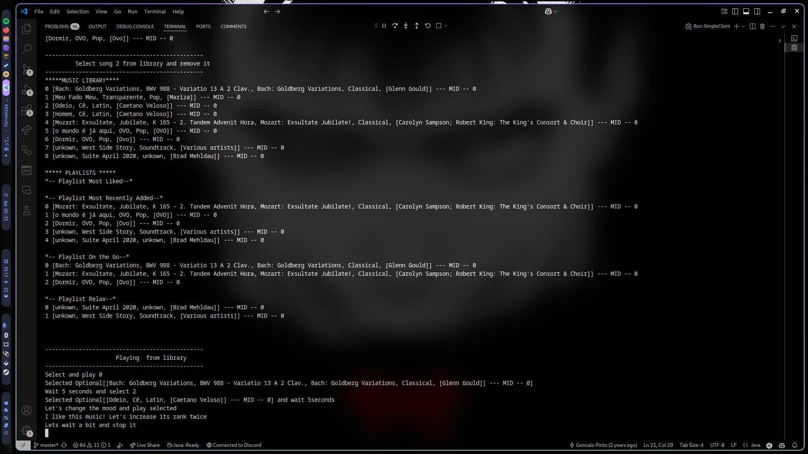

# Desenvolvimento Centrado em Objetos - LEITunes

## Project Preview

  
  
<em>Image: SimpleClient preview</em>

---

## Descrição do Projeto

Este projeto é uma aplicação de biblioteca de músicas que permite gerenciar músicas, playlists e suas avaliações. A aplicação foi desenvolvida utilizando o paradigma de programação orientada a objetos.

## Classes Principais

### AbsQListWithSelection

Na classe abstrata `AbsQListWithSelection.java`, usamos dois atributos (`E selected` e `List<E> objList`) para representar o objeto selecionado e a lista de todos os objetos, respectivamente. A inicialização da lista é feita através do método `createList()`, que pode ser sobrescrito pela classe que estende `AbsQListWithSelection`.

---

### MusicLibraryController

Na classe `MusicLibraryController.java`, realizamos a leitura dos meta-dados das músicas a partir de arquivos mp3 utilizando a biblioteca de código aberto `com.mpatric.mp3agic`.

---

### MusicLibrary e AbsPlaylist

Nas classes `MusicLibrary.java` e `AbsPlaylist.java`, usamos um atributo `songPlaying` que representa a música que está tocando. Se nenhuma música estiver tocando, este valor é `null`.

---

### MostRecentlyAddedSongsPlaylist e MostLikedSongsPlaylist

A classe `MostRecentlyAddedSongsPlaylist.java` representa uma playlist com no máximo 5 músicas que foram mais recentemente adicionadas à biblioteca. A classe `MostLikedSongsPlaylist.java` representa uma playlist com as 5 músicas com maior `Rate`, que são adicionadas quando ocorre um evento de alteração dos seus rates.

## Como Executar

1. Clone o repositório.
2. Execute a classe `SimpleClient` para iniciar a aplicação.

## Licença

Este projeto está licenciado sob a Licença MIT. Veja o arquivo [LICENSE](LICENSE) para mais detalhes.